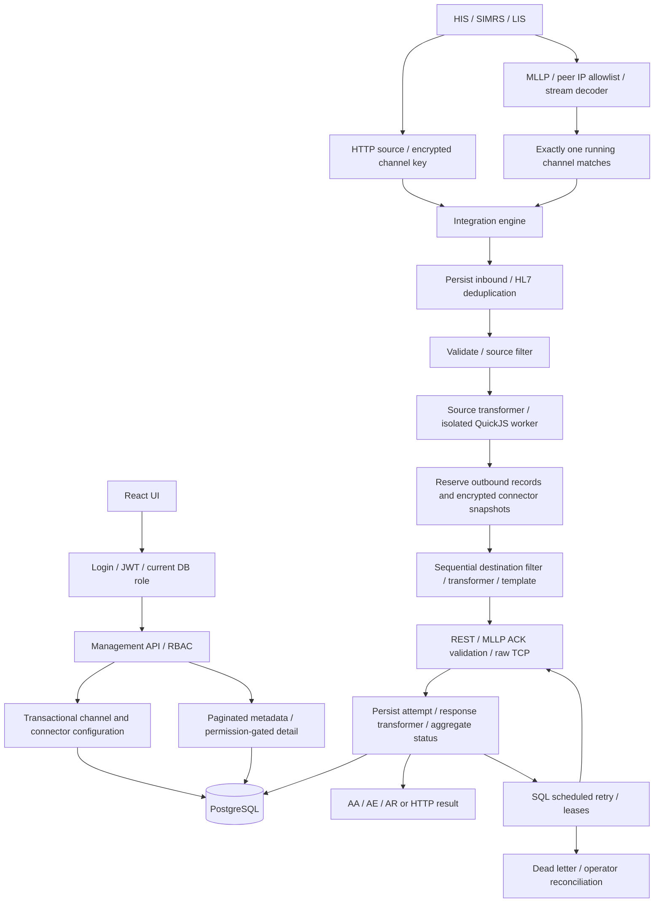

# Architecture

Existing React UI and Express/PostgreSQL architecture are preserved. Root environment is validated once. Shared middleware enforces authentication, current database role, permissions, safe error responses and request trace IDs.

## Message reliability

Receive checks current RUNNING state. Persist inbound before source validation. HL7 sender application/facility/control ID is deduplicated per channel via a unique partial PostgreSQL index and transaction-scoped advisory lock. Reserve all destination records before transport side effects. Source and destination failures remain visible in SQL.

Each outbound record stores a final serialized payload and encrypted connector snapshot. Retries reuse that final payload without repeating transforms. Queue claims use PostgreSQL FOR UPDATE SKIP LOCKED with UPDATE RETURNING; lease recovery marks uncertain delivery as dead letter. Heartbeat extends leases during active inbound work. Network operations are not held inside SQL transactions.

Atomic DB operations: channel + related destinations + audit; outbound attempt status + log; token revocation + logout audit. An ACK is generated only after required persistence finishes. Exactly-once delivery across independent databases/transports is not promised: downstream needs HL7 control-ID deduplication or REST Idempotency-Key support.

## State compatibility

Channel status keeps RUNNING/STOPPED/ERROR; PAUSED is added. Legacy IN/OUT direction and OUT-SENT/OUT-ERROR remain. Inbound final state: RECEIVED, SUCCESS, PARTIAL, FAILED, FILTERED, QUEUED or IN-ERROR. Outbound work: PROCESSING, OUT-SENT, OUT-ERROR, FILTERED, QUEUED, RETRYING, DEAD_LETTER.

Removed destinations are retired, their foreign keys/history remain, and queued jobs become dead letters. Historical channel deletion is refused until messages are resolved/retained successfully and purged. Failure history is not silently erased to make updates succeed.

## Security boundaries

Management JWT and external source API keys are separate. Source keys/endpoints/snapshots use AES-256-GCM. Endpoint credentials never appear in channel-list responses. Script configuration is returned only to ADMIN/DEVELOPER. PHI is absent from metadata listing and structured application logs; raw detail requires permission and is audited.

QuickJS runs interpreted JavaScript in a WebAssembly interpreter inside a Node worker. It receives only serialized data and pure helper source. No host callbacks/module loader/Node globals/network helpers are exposed. Interpreter memory/stack/CPU, worker heap, wall-clock and concurrency are bounded. The whole engine still needs deployment resource limits and defense against dependency/runtime vulnerabilities.

HTTP destination requests validate exact host allowlist, pin DNS addresses, reject link-local/metadata destinations and redirects, and cap body/response and request time. PostgreSQL is encrypted with certificate verification in production. MLLP is plaintext and must be enclosed in a protected network/TLS tunnel.

## Operational boundaries

One engine instance owns its shared MLLP bind address. SQL retry claims support competing workers, but multi-instance routing, load balancing and HA have not been qualified. Start/stop prevents new receive; already accepted work finishes. Graceful shutdown stops accepting traffic, drains active work, stops scheduler and closes the pool, with a bounded deadline.

Retention uses bounded batches of resolved messages and independent audit retention. Unresolved failure/dead-letter records require operator reconciliation. UTC is used for new SQL writes and timestamps; old localized timestamps need a separately reviewed conversion.

## Verification boundaries

Automated API/channel/worker tests mock database sessions; a separate PostgreSQL adapter test verifies binding and same-client transaction behavior. REST/MLLP tests use real loopback sockets. Browser tests use explicit synthetic fixtures. `npm run test:sql` validates native PostgreSQL on a newly created `mirth_test_*` schema which is deleted afterward. Six live PostgreSQL scenarios have passed. Docker image, hospital-specific HL7 profiles, load and disaster recovery still require deployment validation.
